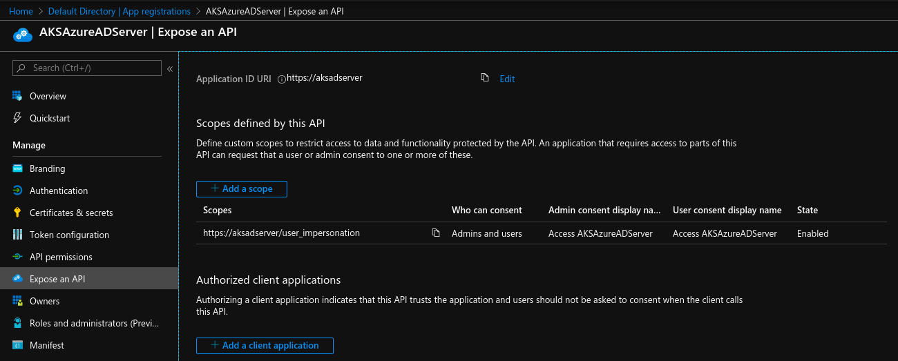
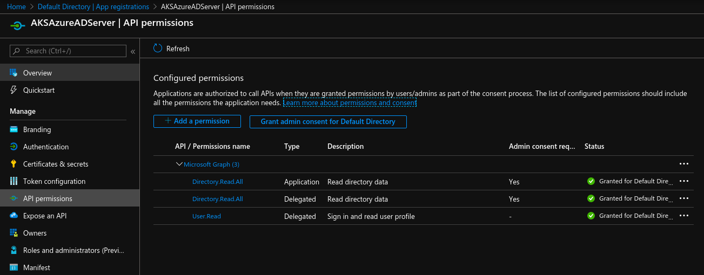
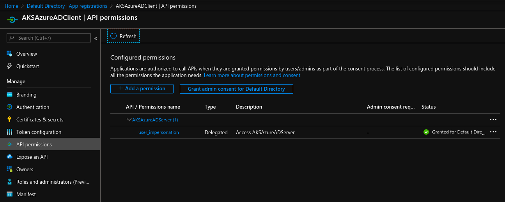
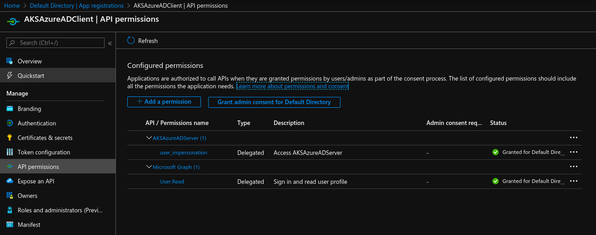

### Azure Acitve Directory + AKS

Official Azure doc [here](https://docs.microsoft.com/en-us/azure/aks/azure-ad-integration).  
Similar repo [here](https://github.com/jcorioland/aks-rbac-azure-ad) but out-of-date..


#### # manifest

Details are [here](https://docs.microsoft.com/en-us/azure/active-directory/develop/reference-app-manifest) and [there](https://www.microsoftpressstore.com/articles/article.aspx?p=2473127).

```
# "resourceAppId": "00000002-0000-0000-c000-000000000000"   >> refers to the Azure Active Directory Graph
# "resourceAppId": "00000003-0000-0000-c000-000000000000"   >> refers to the Microsoft Graph API
```

More details which one is recommended is explained [here](https://developer.microsoft.com/en-us/office/blogs/microsoft-graph-or-azure-ad-graph/).  

**MS Graph** manifest is [here](./manifest.json).  
**Azure AD Graph** manifest is [here](./manifest-aad-graph.json).

**Server app** is using by default **MS Graph**:
```
--required-resource-accesses @manifest.json
```


#### # server app

Details are [here](https://docs.microsoft.com/en-us/azure/aks/azure-ad-integration#create-the-server-application).

```
# load vars

$ export AD_SERVER_APP_NAME="AKSAzureADServer" &&\
export AD_SERVER_APP_URL="https://aksadserver" &&\
export AD_SERVER_APP_SECRET="$(head /dev/urandom | tr -dc A-Za-z0-9 | head -c 32 ; echo '')"


# run and check the output

$ ./server-ad-app.sh
```



For **MS Graph**:



[optional] For **Azure AD Graph**:


#### # client app

Details are [here](https://docs.microsoft.com/en-us/azure/aks/azure-ad-integration#create-the-client-application).

```
# load vars from the server script

$ export AD_SERVER_APP_ID=<> &&\
export AD_SERVER_APP_OAUTH2PERMISSIONS_ID=<> &&\
export AD_SERVER_APP_SECRET=<>


# load vars

$ export AD_CLIENT_APP_NAME="AKSAzureADClient" &&\
export AD_CLIENT_APP_URL="https://aksadclient"


# run and check the 

$ ./client-ad-app.sh
```




It's **optional**, can be enabled/switched [here](./client-ad-app.sh).  




#### # AKS

Details are [here](https://docs.microsoft.com/en-us/azure/aks/azure-ad-integration#deploy-the-aks-cluster).

```
# load vars from the client script

$ export TF_VAR_rbac_server_app_id=<> &&\
export TF_VAR_rbac_server_app_secret=<> &&\
export TF_VAR_rbac_client_app_id=<>

# When you create an Azure AD-enabled AKS cluster, this value is called the tenant ID
# Azure Active Directory >> Properties >> Directory ID

export TF_VAR_tenant_id=<>

export TF_VAR_client_id=<> && \
export TF_VAR_client_secret=<>

$ cd ./basic
$ terraform init
$ terraform plan -out out.plan
$ terraform apply out.plan
```

#### # RBAC

Details are [here](https://docs.microsoft.com/en-us/azure/aks/azure-ad-integration#create-an-rbac-binding).

```

# load env vars

$ CLUSTER_NAME=aadk8s
$ RESOURCE_GROUP_NAME=aadk8srg


# create user

$ az ad user create --display-name <display_name> --password <password> --user-principal-name <username>@<E-mail of LifeID>.onmicrosoft.com


# ADMIN

$ az aks get-credentials -n $CLUSTER_NAME -g $RESOURCE_GROUP_NAME --admin

# edit 'rbac/rbac-aad-user.yaml' with your user: '<username>@<E-mail of LifeID>.onmicrosoft.com'
$ k apply -f rbac/rbac-aad-user.yaml

$ az aks get-credentials -n $CLUSTER_NAME -g $RESOURCE_GROUP_NAME


# USER

$ k get namespaces
To sign in, use a web browser to open the page https://microsoft.com/devicelogin and enter the code CSNWAJ34U to authenticate.
NAME              STATUS   AGE
default           Active   16m
kube-node-lease   Active   16m
kube-public       Active   16m
kube-system       Active   16m

$ k get pods
No resources found in default namespace.
```